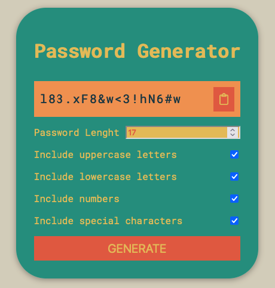

# Password-Generator
Welcome to the Password Generator! This simple tool allows you to create a unique and secure password for your online accounts.

## Screenshot

## How to Use
Using the Password Generator is easy! Simply follow these steps:

Select the desired length of your password by choosing a number in the "Length" field.
Choose the types of characters you want to include in your password by selecting the appropriate checkboxes. You can include lowercase letters, uppercase letters, numbers, and symbols.
Click the "Generate Password" button to generate a new password. The generated password will be displayed in the "Result" field.
If you want to copy the generated password to your clipboard, simply click the "Copy to Clipboard" button.
That's it! You now have a new, secure password that you can use to protect your online accounts.

## Deployment

https://aloosli.github.io/Password-Generator/

Credits
The Password Generator was created using JavaScript and the DOM API. It was designed and developed by Brad Traversy.https://www.udemy.com/course/50-projects-50-days/
